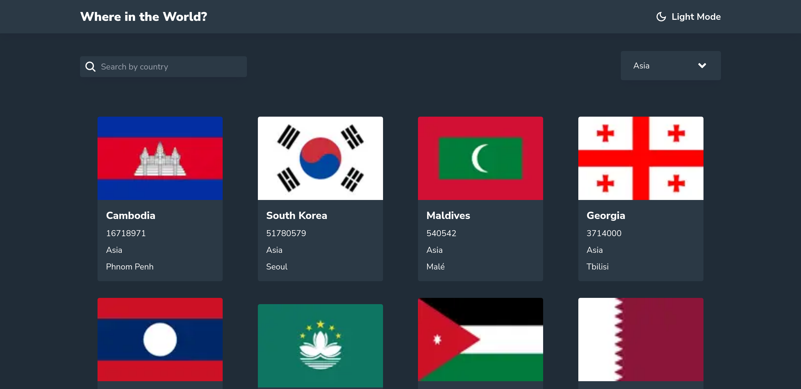
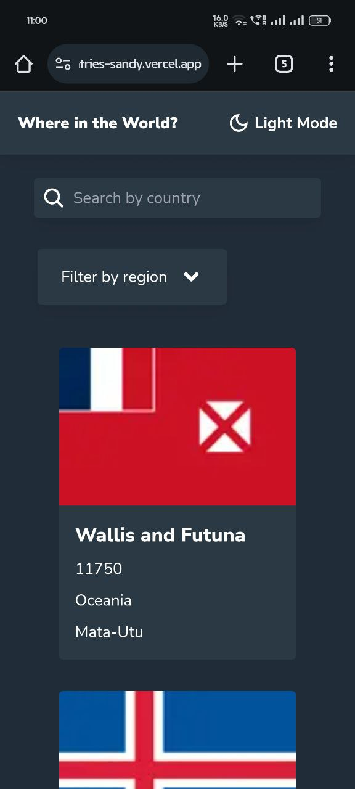

# Frontend Mentor - REST Countries API with color theme switcher solution

This is a solution to the [REST Countries API with color theme switcher challenge on Frontend Mentor](https://www.frontendmentor.io/challenges/rest-countries-api-with-color-theme-switcher-5cacc469fec04111f7b848ca). Frontend Mentor challenges help you improve your coding skills by building realistic projects. 

## Table of contents

- [Overview](#overview)
  - [The challenge](#the-challenge)
  - [Screenshot](#screenshot)
    - [Desktop](#desktop-design)
    - [Mobile](#mobile-design)
  - [Links](#links)
- [My process](#my-process)
  - [Built with](#built-with)
  - [What I learned](#what-i-learned)
  - [Continued development](#continued-development)
  - [Useful resources](#useful-resources)
- [Author](#author)

## Overview

### The challenge

Users should be able to:

- See all countries from the API on the homepage
- Search for a country using an `input` field
- Filter countries by region
- Click on a country to see more detailed information on a separate page
- Click through to the border countries on the detail page
- Toggle the color scheme between light and dark mode *(optional)*

### Screenshot

#### Desktop Design

#### Mobile Design

### Links

- Solution URL: [Frontend Mentor Solution](https://www.frontendmentor.io/challenges/rest-countries-api-with-color-theme-switcher-5cacc469fec04111f7b848ca/hub?share=true)
- Live Site URL: [Rest Countries Application](https://rest-countries-sandy.vercel.app/)

## My process

### Built with

- Mobile-first workflow
- [React](https://reactjs.org/) - JS library
- [Next.js](https://nextjs.org/) - React framework
- [TailwindCSS](https://tailwindcss.com/) - For styles

### What I learned

- During this project, I learned how to effectively integrate APIs into a Next.js application, manage state with React hooks, and improve UI/UX using TailwindCSS for styling.
- Handling nested routing for detailed country information and integrating context providers for theme management were also key takeaways.

### Continued development

 - In future projects, I plan to continue refining my skills in API integration, particularly with complex data structures and pagination. I also aim to enhance my knowledge of TypeScript to further strengthen type safety throughout my applications.

### Useful resources

- [Next.js Documentation](https://nextjs.org/) - This helped me for implementing dynamic routing.
- [TailwindCSS Documentation](https://tailwindcss.com/) - This helped me for dark mode styles in application.

## Author

- Website - [Subashkumar S](https://subashkumar-s.vercel.app/)
- Frontend Mentor - [@Subashkumar-S](https://www.frontendmentor.io/profile/Subashkumar-S)
- LinkedIn   - [@subashkumar-s](https://www.linkedin.com/in/subashkumar-s/)

